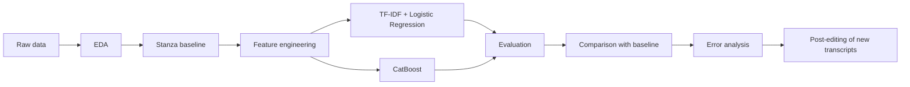

## **Постредактирование автоматической морфологической разметки устной русской речи**
*ML-проект по автоматическому исправлению ошибок POS-разметки устной русской речи после парсера Stanza*

---
### **Автор**

**Ирина Петрова** 

---
### **О проекте**

Проект посвящён постредактированию автоматической морфологической разметки устной русской речи. Он является продолжением предыдущего исследования, в котором сравнивались пять современных морфологических парсеров русского языка  с ручной POS-разметкой (на материалах [КУРС](https://esc-corpus.ru/)). По результатам сравнения наиболее стабильные результаты показала Stanza, поэтому именно она используется в качестве исходной в настоящем проекте.

**Цель работы** — научить модели машинного обучения автоматически исправлять ошибки POS-теггинга Stanza.

После обучения модели применяются для разметки новых расшифровок устной речи.

---
### **Задача**
Повысить качество POS-разметки устной русской речи, автоматически полученной с помощью Stanza, используя модели машинного обучения, учитывающие как лексические, так и контекстные признаки токена.

### **Гипотеза**
Ошибки автоматической POS-разметки Stanza имеют закономерный характер и могут быть исправлены моделью машинного обучения, использующей информацию о самом токене и его контексте.

### **Данные**
Обучающий корпус
* 340 предложений
* 2476 токенов
* ручная POS-разметка (gold standard)

Используемые признаки
```
token
lemma
POS Stanza
предыдущий токен
следующий токен
POS предыдущего токена
POS следующего токена
длина токена

Целевая переменная: pos_gold
```
### **Baseline**
В качестве базовой модели используется **Stanza**, выбранная по итогам предыдущего сравнительного исследования нескольких морфологических парсеров русского языка.
### **Модели**
1. TF-IDF + Logistic Regression 
2. CatBoostClassifier

### **Метрики**
macro-F1 (используется из-за несбалансированности распределения частей речи.)




---
### **Запуск**
```bash
1. Установка зависимостей
pip install -r requirements.txt

2. Обучение моделей на обучающем датасете
# Загрузка и валидация данных
python -m src.data.loader

# Разведочный анализ (EDA)
python -m src.data.eda

# Оценка baseline (Stanza)
python -m src.models.baseline

# Обучение TF-IDF + Logistic Regression (3 итерации)
python -m src.models.tfidf_lr

# Обучение CatBoost (3 итерации)
python -m src.models.catboost_model

После обучения в experiments/trained_models/ появятся файлы:
tfidf_lr_full.pkl
catboost_full.pkl

3. Пост-редактирование новых данных
# Все модели (TF-IDF+LR и CatBoost)
python run_postedit.py data/raw/new_data.xlsx --no-gold

# Только одна модель
python run_postedit.py data/raw/new_data.xlsx --models tfidf_lr

# С gold-разметкой (если есть колонка pos_gold)
python run_postedit.py data/raw/new_data.xlsx

4. Анализ ошибок
python -m src.models.error_analysis
```

---
### **Используемые библиотеки**
```
pandas
numpy
scikit-learn
CatBoost
Stanza
matplotlib
```


---


### **Использование ИИ**

Проект выполнен индивидуально. В процессе работы использовался **Qwen3.7** для:
- Генерации архитектурной схемы (Mermaid)
- Написания шаблонного кода модулей
- Отладки ошибок 
- Для настройки `.gitignore`
- Адаптации кода под конкретные данные (исправление системы POS-тегов, контекстных признаков)

Весь код был проверен, адаптирован под конкретные данные и запущен вручную. ИИ-артефакты удалены, логика прокомментирована. Все решения (выбор метрики, признаков, моделей) принимались самостоятельно.
